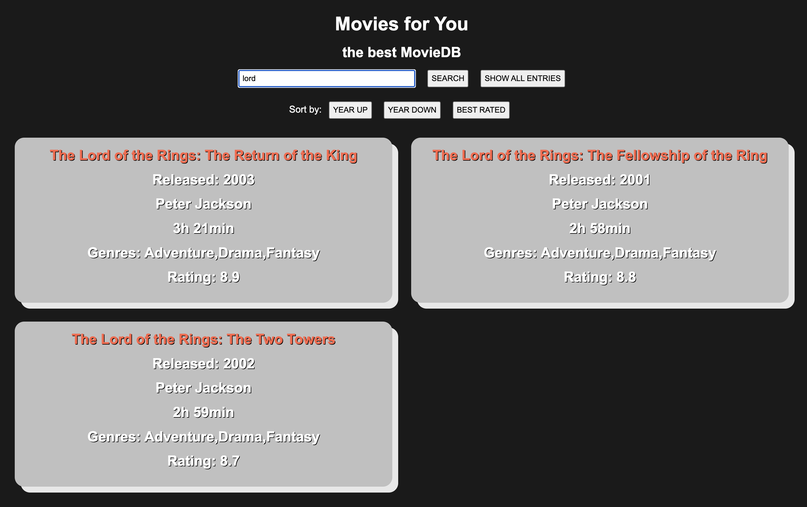

# Project Movie Database

A database containing 125 movie informations in a single array. Movies can be searched by name, date, genre or director and sorted after year and rating.

Used methods:
- Arrow-functions
- EventListeners
- If-functions
- Arrays
- Filter
- '${}'
- Sort 
- Include
- Spread-Operator [...abc]
## Screenshots

## Flowchart / Programmablaufsplan

